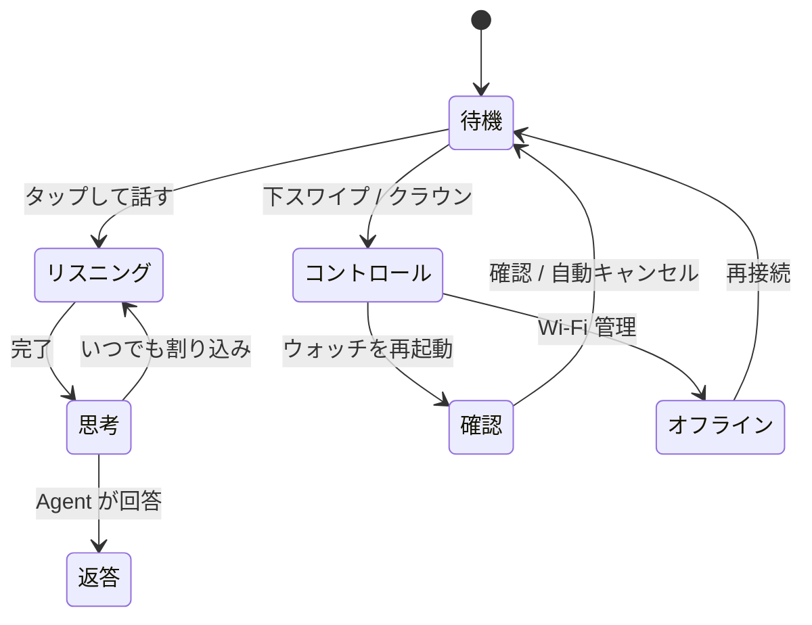

<div align="center">


# LUMEN

### 手首につけるインテリジェントエージェント

自然な対話、リアルタイム情報、デバイス制御、パーソナルな記憶 ——
温かく静かなインターフェイスで、ESP32 ウォッチを持ち歩くエージェントに。

[English](README.md) · [繁體中文](README.zh-TW.md) · [**日本語**](README.ja.md)

[](https://jiapunk.github.io/lumen-watch-site/)
[](https://nextjs.org)
[](https://react.dev)
[](https://www.typescriptlang.org)

**Personal intelligence, quietly present.** · Concept 2026

</div>

---

これは **Lumen Agent Watch** の製品紹介サイトです。静的なパンフレットではなく、
**操作できるインタラクティブデモ**です。訪問者はウォッチの各状態（待機、リスニング、
思考、返答、コントロール、確認、オフライン）をクリックして、腕上エージェントの
インタラクションフローをブラウザでそのまま体験できます。

## 🌐 公開サイト

**サイトはデプロイ済み、そのまま操作できます：[https://jiapunk.github.io/lumen-watch-site/](https://jiapunk.github.io/lumen-watch-site/)**

## 画面プレビュー

| 待機 | 返答中（音声と字幕を同期） |
|---|---|
|  |  |
| **コントロールセンター** | **リスニング** |
|  |  |

## サイトの内容

| セクション | 説明 |
|---|---|
| **インタラクティブウォッチデモ** | 7 つの状態を完全シミュレーション：待機時計、タップして話す、ライブ字幕返答、コントロールセンター（音量 / Wi-Fi / 再起動）、腕上での確認、オフライン復旧 |
| **01 / 能力** | 3 つの柱：割り込み可能なリアルタイム音声、「答えから行動へ」の Agent、話者を認識するパーソナルメモリ |
| **02 / アーキテクチャ** | Lumen Watch（エッジ）× Agent Gateway（東京 · 香港）× モデル & ツールのレイヤー図 |
| **03 / 信頼** | 腕上確認、オフライン復旧、省電力設計のプロダクト原則 |
| **ビジョン** | 「テクノロジーは冷たく見える必要も、使い方を学ばせる必要もない」 |

## デモのステートマシン



## 技術

- **Next.js 16**（App Router）+ **React 19** + **TypeScript 5.9**
- 純フロントエンド、依存ゼロのアニメーション（CSS の `flow-field` と `signal-bars` はハンドメイド）
- `zh-Hant` ロケール、Geist フォント、アクセシビリティマークアップ（`aria-pressed` / `aria-label` / `role="img"`）

## 開発

```sh
npm install
npm run dev     # ローカル開発
npm run build   # 本番ビルド（vinext）
```

**GitHub Pages デプロイ**（静的エクスポート）：

```sh
PAGES_BUILD=1 npx next build   # out/ を出力（basePath=/lumen-watch-site）
```

`gh-pages` ブランチが GitHub Pages で提供する静的エクスポートです。

## 関連リポジトリ

- 🛠️ [xiaozhi-agent-platform](https://github.com/jiapunk/xiaozhi-agent-platform) — ウォッチの完全な実装プラットフォーム（ESP32-S3 ファームウェア + Go Gateway + コンパニオンアプリ）
- 📘 [xiaozhi-esp-claw-blueprint](https://github.com/jiapunk/xiaozhi-esp-claw-blueprint) — 製品化ブループリント

---

<div align="center">

**LUMEN** · Personal intelligence, quietly present.

</div>
