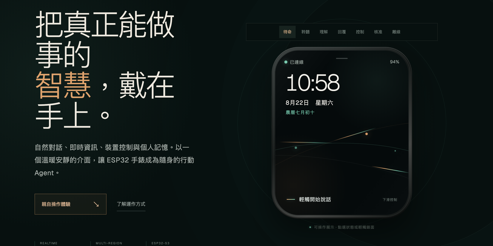
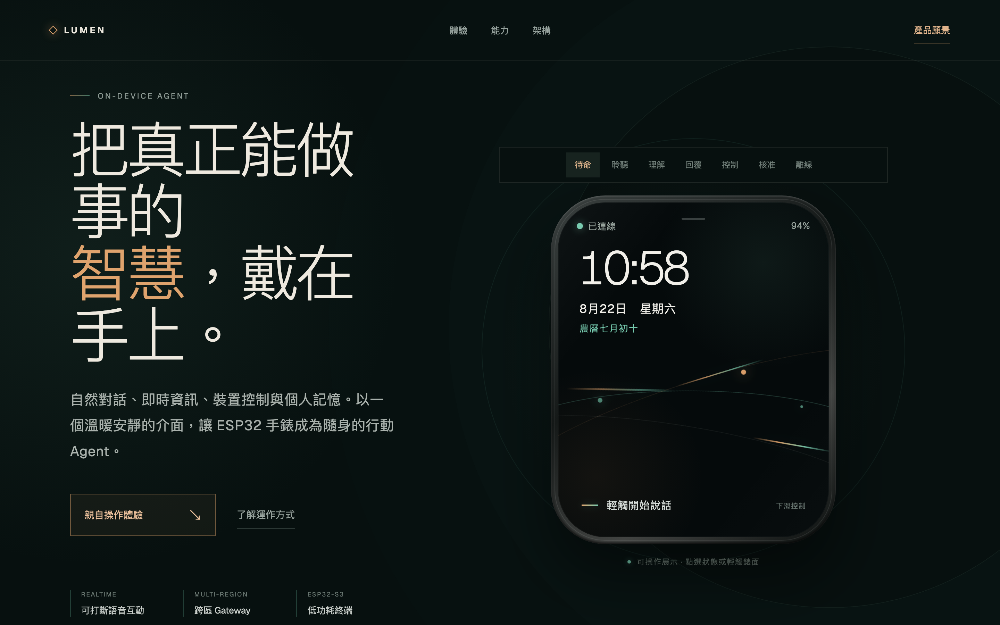
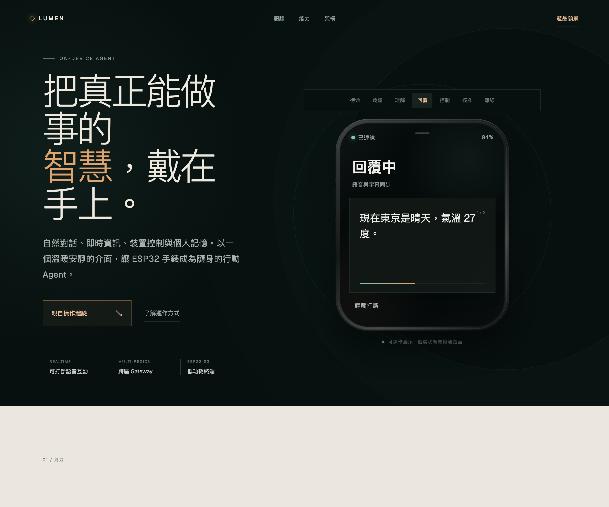
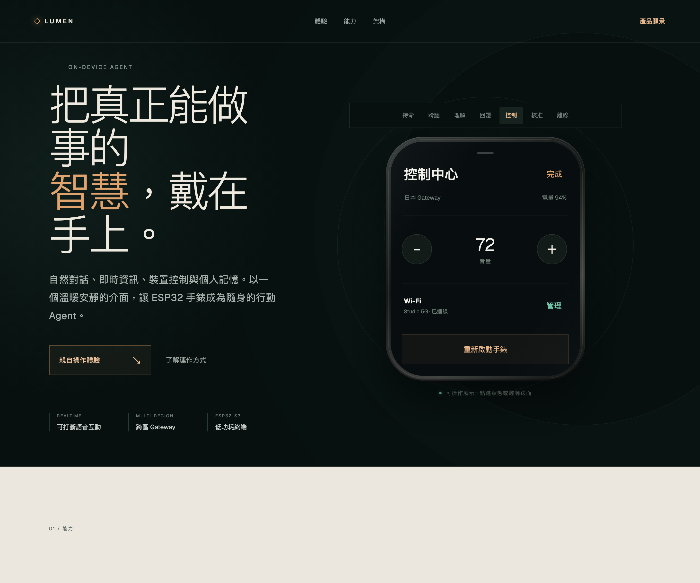
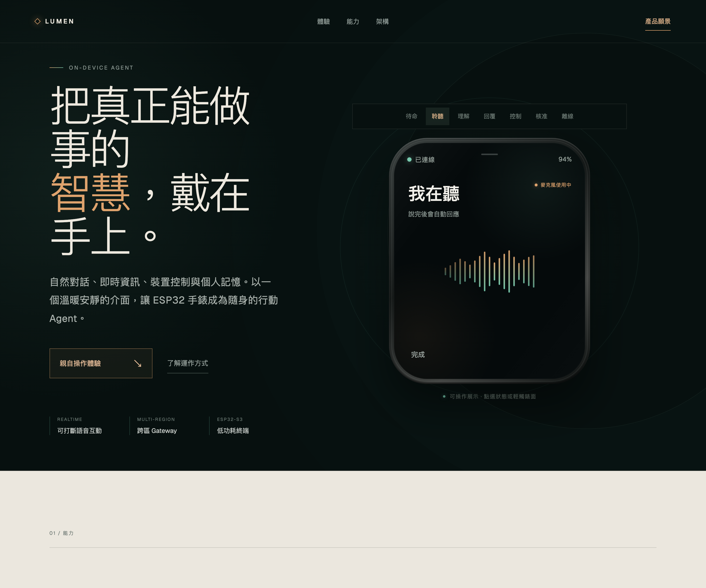
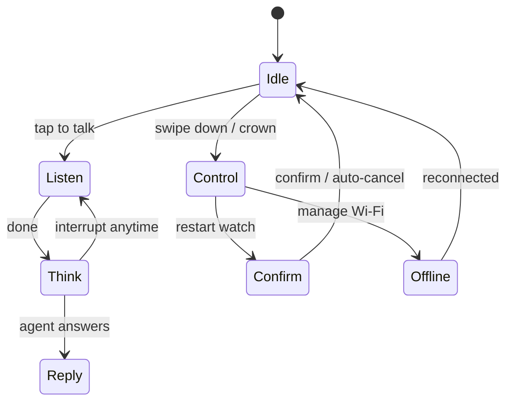

<div align="center">



# LUMEN

### An intelligent agent, worn on your wrist

Natural conversation, real-time information, device control and personal memory —
a warm, quiet interface that turns an ESP32 watch into your on-the-go agent.

[**English**](README.md) · [繁體中文](README.zh-TW.md) · [日本語](README.ja.md)

[](https://jiapunk.github.io/lumen-watch-site/)
[](https://nextjs.org)
[](https://react.dev)
[](https://www.typescriptlang.org)

**Personal intelligence, quietly present.** · Concept 2026

</div>

---

This is the product introduction site for the **Lumen Agent Watch** — not a static
brochure, but an **operable interactive demo**: visitors can click through the watch's
states (idle, listen, think, reply, control, confirm, offline) and preview the full
wrist-agent interaction flow right in the browser.

## 🌐 Try it live

**The site is deployed and fully interactive: [https://jiapunk.github.io/lumen-watch-site/](https://jiapunk.github.io/lumen-watch-site/)**

## Interface preview

| Idle | Replying (voice + captions in sync) |
|---|---|
|  |  |
| **Control center** | **Listening** |
|  |  |

## What's on the site

| Section | Description |
|---|---|
| **Interactive watch demo** | Simulates all seven watch states: idle clock, tap-to-talk, live caption replies, control center (volume / Wi-Fi / restart), on-wrist confirmation, offline recovery |
| **01 / Capabilities** | Three pillars: interruptible real-time voice, agents that act (not just answer), speaker-aware personal memory |
| **02 / Architecture** | Layered map: Lumen Watch (edge) × Agent Gateway (Tokyo · Hong Kong) × models & tools |
| **03 / Trust** | Product principles: on-wrist confirmation, offline recovery, power-aware design |
| **Vision** | "Technology doesn't need to look cold, and you shouldn't have to learn how to use it." |

## The demo's state machine



## Technology

- **Next.js 16** (App Router) + **React 19** + **TypeScript 5.9**
- Pure front-end, zero-dependency animations (the CSS `flow-field` and `signal-bars` are hand-crafted)
- `zh-Hant` locale, Geist typefaces, accessibility markup (`aria-pressed` / `aria-label` / `role="img"`)

## Development

```sh
npm install
npm run dev     # local development
npm run build   # production build (vinext)
```

**GitHub Pages deployment** (static export):

```sh
PAGES_BUILD=1 npx next build   # outputs out/ (basePath=/lumen-watch-site)
```

The `gh-pages` branch holds the static export served by GitHub Pages.

## Related repositories

- 🛠️ [xiaozhi-agent-platform](https://github.com/jiapunk/xiaozhi-agent-platform) — the watch's full implementation platform (ESP32-S3 firmware + Go gateway + companion app)
- 📘 [xiaozhi-esp-claw-blueprint](https://github.com/jiapunk/xiaozhi-esp-claw-blueprint) — the product blueprint

---

<div align="center">

**LUMEN** · Personal intelligence, quietly present.

</div>
