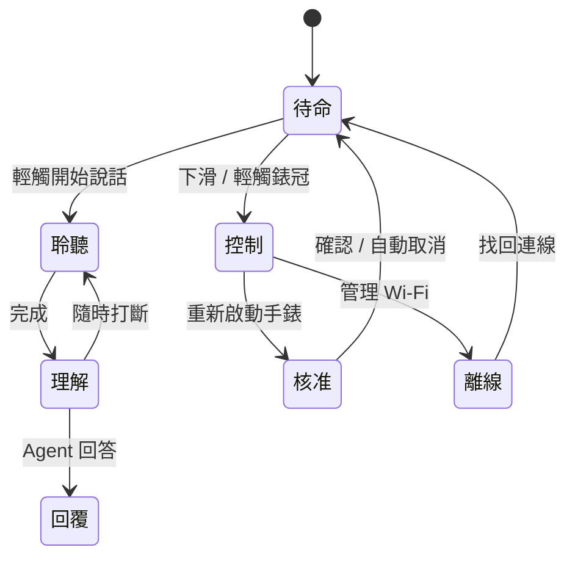

<div align="center">

# LUMEN

### 戴在手上的智慧 Agent

自然對話、即時資訊、裝置控制與個人記憶 ——
以一個溫暖安靜的介面，讓 ESP32 手錶成為隨身的行動 Agent。

[](https://nextjs.org)
[](https://react.dev)
[](https://www.typescriptlang.org)

**Personal intelligence, quietly present.** · Concept 2026

</div>

---

這是 **Lumen Agent Watch** 的產品介紹網站 —— 不只是靜態頁面，而是一個**可操作的互動展示**：
訪客可以直接點選手錶的各種狀態（待命、聆聽、理解、回覆、控制、核准、離線），
在瀏覽器裡預覽腕上 Agent 的完整互動流程。

## 網站內容

| 區塊 | 說明 |
|---|---|
| **互動手錶展示** | 完整模擬七種手錶狀態：待命時鐘、觸控說話、即時字幕回覆、控制中心（音量 / Wi-Fi / 重啟）、腕上二次核准、離線恢復流程 |
| **01 / 能力** | 三大核心：即時可打斷語音、從回答走向行動的 Agent、認得人的個人記憶 |
| **02 / 架構** | Lumen Watch（Edge）× Agent Gateway（Tokyo · Hong Kong）× 模型與工具的分層架構圖 |
| **03 / 信任** | 腕上確認、斷線恢復、省電設計的產品原則 |
| **產品願景** | 「科技不需要看起來冰冷，也不必讓人學會如何使用」 |

## 互動展示的狀態機



## 技術

- **Next.js 16**（App Router）+ **React 19** + **TypeScript 5.9**
- 純前端、零依賴動畫（CSS `flow-field`、`signal-bars` 均為手刻）
- `zh-Hant` 語系、Geist 字體、無障礙標記（`aria-pressed` / `aria-label` / `role="img"`）

## 開發

```sh
npm install
npm run dev     # 本機開發
npm run build   # 生產建置
```

## 相關 Repo

- 🛠️ [xiaozhi-agent-platform](https://github.com/jiapunk/xiaozhi-agent-platform) — 手錶的完整實作平台（ESP32-S3 韌體 + Go Gateway + Companion App）
- 📘 [xiaozhi-esp-claw-blueprint](https://github.com/jiapunk/xiaozhi-esp-claw-blueprint) — 產品化藍圖

---

<div align="center">

**LUMEN** · Personal intelligence, quietly present.

</div>
